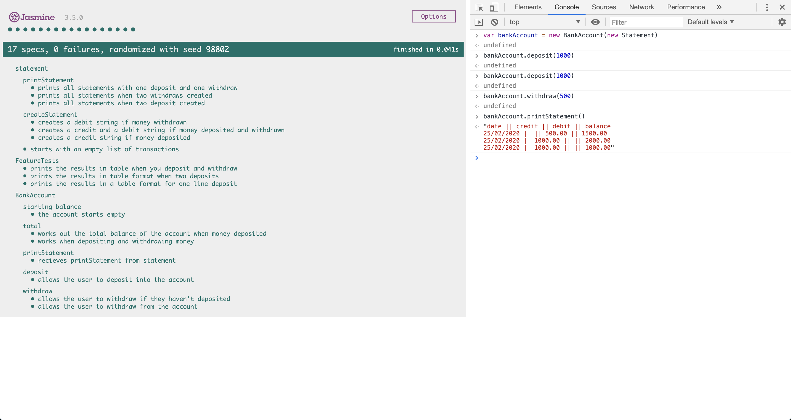

# Bank Tech Test

## Overview
  Simple console banking app, which allows a user to create a Bank Account, deposit into it, withdraw from it and print their statement to see their transactions in a table format.

## Setup
* Clone this repo
* Open SpecRunner.html in browser

## How to run
  * Open the console through the developer tools
  * Create a new Bank Account and pass in a new statement: 

  ```
  var bankAccount = new BankAccount(new Statement)

  ```

  * Make a deposit by calling:
  
  ```
  bankAccount.deposit(1000)

  ```

  * Make a witdrawal by calling:

  ```
  bankAccount.withdraw(500)

  ```

  * Print statement by calling:
  
  ```
  bankAccount.printStatement()

  ```

  * This will print out your statement:

  ```
  date || credit || debit || balance
  14/01/2012 || || 500.00 || 500.00
  10/01/2012 || 1000.00 || || 1000.00

  ```


#### ScreenShot of How Program Works




## How to run tests
  * Open the SpecRunner in your browser

### Code Structure
* This program is structured between two constructor functions BankAccount and Statement. The BankAccount constructor takes care of withdrawing, depositing and working out the account total and then passes the values to the Statement Constructor to create a statement and print it. This then clearly separates the dependencies of the account and leaves the 


## Requirements
  * You should be able to interact with your code via a REPL like IRB of the JavaScript Console
  * Deposits, withdrawal
  * Account statement(date, amount, balance) printing
  * Data can be kept in memory(it doesn't need to be stored in a database or anything)

  ## Acceptance Criteria
  * Given a client makes a deposit of 100 on 10-01-2012
  * And a deposit of 2000 on 13-01-2012
  * And a withdrawal of 500 on 14-01-2012
  * When she prints her bank statement
  * Then she would see:
      date || credit || debit || balance
      14/01/2012 || || 500.00 || 2500.00
      13/01/2012 || 2000.00 || || 3000.00
      10/01/2012 || 1000.00 || || 1000.00